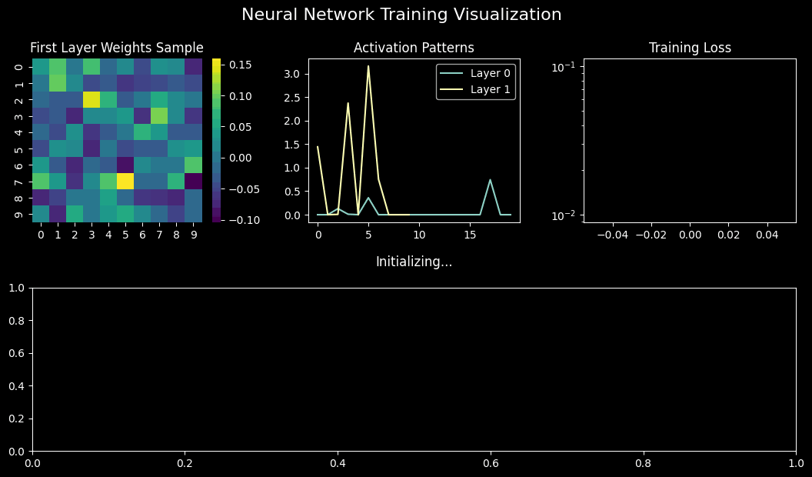
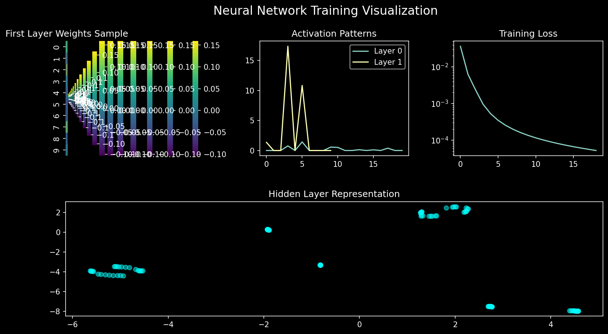

# Neural Network Implementation from Scratch

## Overview
A from-scratch implementation of backpropagation using only NumPy. Built to understand the fundamentals of neural networks by implementing `gradient descent` and the `chain rule`.

* Backpropagation is the process of calculating the gradient of the loss function with respect to the weights of the network.

## Features
- Dense layers with customizable units
- ReLU and Softmax activations
- Mini-batch gradient descent
- Cross-entropy loss
- MNIST dataset training example

## Training Visualization
Latest training run:


## Interactive Dashboard


## Core Components
```python
# Key mathematical operations:
forward_pass = inputs @ weights + bias
backward_pass = gradient @ weights.T  # Chain rule
weight_updates = learning_rate * input.T @ gradient
```
````markdown